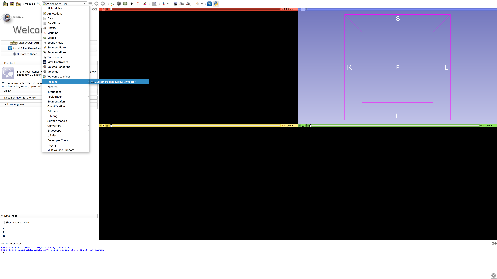
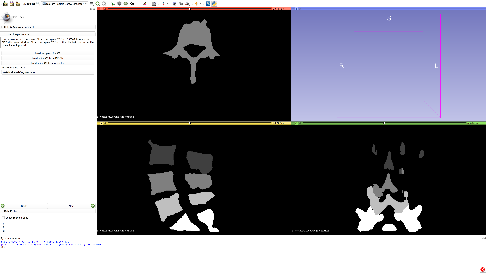
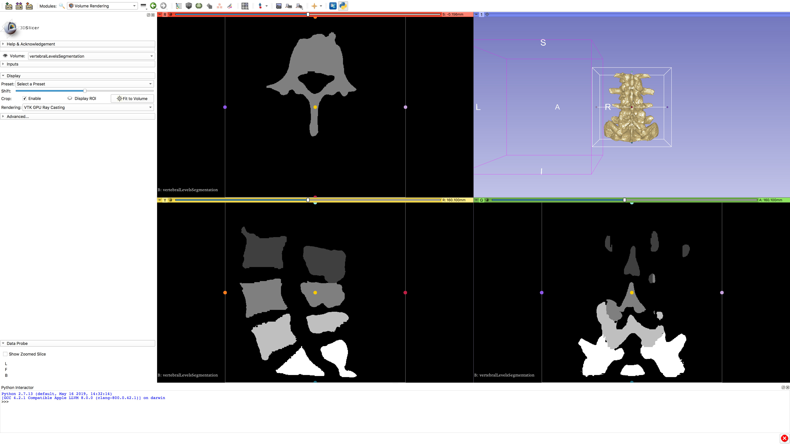
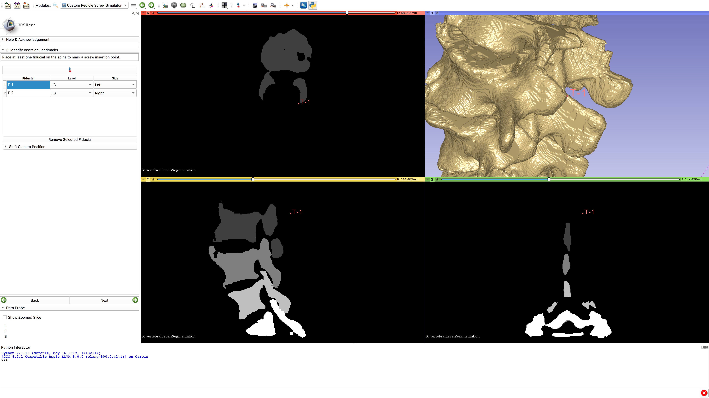

# Pedicle Screw Simulator

A pedicle screw placement planning simulator built as module for 3D Slicer.
Supports placement of screws on CT images in any file format supported by VTK
(DICOM, Nifti, Nrrd, MHA, etc). This repository is a fork of a fork of the original
module designed by the Sunnybrook Research Institute in Toronto.

## Installation

1. Download and install [3D Slicer v4.10.2](https://slicer.kitware.com/midas3/folder/274) using one of the following links:
    - [Linux](https://slicer.kitware.com/midas3/download/item/435293/Slicer-4.10.2-linux-amd64.tar.gz)
    - [MacOS](https://slicer.kitware.com/midas3/download/item/433773/Slicer-4.10.2-macosx-amd64.dmg)
    - [Windows](https://slicer.kitware.com/midas3/download/item/433684/Slicer-4.10.2-win-amd64.exe)
2. Download the contents of this repository using one of the following methods:
    - Using Git in a terminal: `git clone --branch custom https://github.com/roozbehshams/PedicleScrewSimulator`
    - Via the releases page (extract the contents): https://github.com/roozbehshams/PedicleScrewSimulator/releases/tag/v1.0
3. Install the module in 3D Slicer:
    1. Launch 3D Slicer
    2. Open the **Edit/Application Settings**
    3. Switch to the **Modules** menu item in the left navigation
    4. In the **Additional module paths**, *Add* a path to the `PedicleScrewSimulator` folder inside the previously downloaded path (`PedicleScrewSimulator/PedicleScrewSimulator`)
    5. Click **OK**, 3D Slicer should prompt to relaunch the application in order to correctly load the module

> Note: In step *3.4*, the correct path to be added must be to the folder called `PedicleScrewSimulator` which is situated inside
> the cloned/extracted directory of the same name. For example: `/home/JohnDoe/PedicleScrewSimulator/PedicleScrewSimulator`.

## Documentation

To start, load the module called `Training/Custom Pedicle Screw Simulator` in the modules dropdown menu at the top of the window. 

### Usage

For each of the following step, once completed, press the `Next` button in the bottom left of the window. Each screenshot below shows the 3D Slicer window before pressing the `Next` button:

1. Drag-and-drop the segmentation file into 3D Slicer, press `OK` to load the volume 

> Note: If the 3D view (top right "blue" quadrant) does not show a rendered vertebra model, switch to the `Volume Rendering` module from the dropdown menu and press `Fit to Volume`. 

> Tip: In the *Rendering* option in the left panel, select *VTK GPU Ray Casting* for improved performance.

2. Select the appropriate *1st Instrumented Level* as well as the *# to Instrument*. The number of levels selected goes down the spine (ie. *L3* with 3 levels -> *L3*, *L4*, *L5*). Optionally adjust the bounding box to only select the vertebra levels of interest by dragging the colored dots in any of the four quadrants. 
3. Place the landmarks corresponding to the desired entrypoints. There will be an opportunity to correct the placement in the next step too. [Download the following video for a demonstration](https://github.com/roozbehshams/PedicleScrewSimulator/blob/custom/doc/5-Placing-landmarks.mp4?raw=true). 
4. Adjust the landmark position:
    1. Click on each of the *fiducials* to jump the camera to its location
    2. Click `Adjust Landmarks` to be able to move the landmarks by dragging them. Click `Fix Landmarks` once done.
    3. Click `Start Measuring` to place a ruler anywhere in the scene.
    4. Under `Change Slice Reconstruction`, adjust the *Rotation Angle* for any of the available quadrants (Red or Yellow)
5. For each *Insertion Site*, select a *Screw Length* and *Screw Width*, `Load Screw`, make any *Vertical Adjustment* or *Horizontal Adjustment* and `Insert Screw`.
6. Save (ie `File/Save` or `Cmd + s` or `Ctrl + s`)
